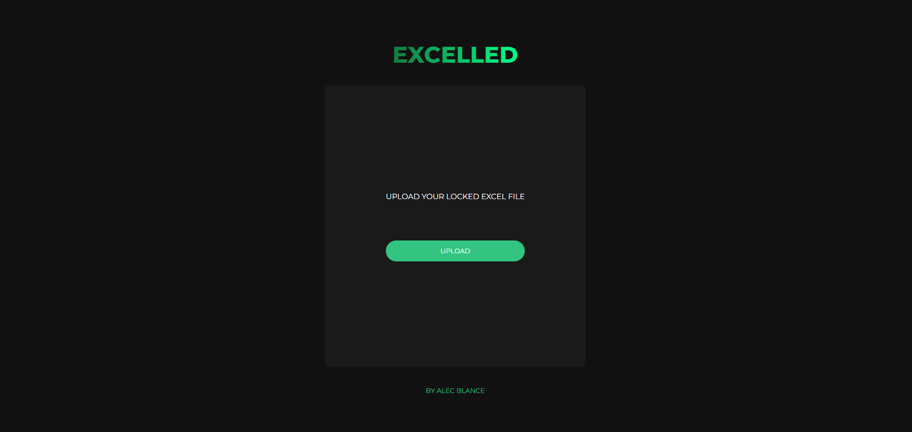

# 📄 Excelled-web

A web app that unlocks/bypasses password-protected excel file. Its process runs totally on the client-side without saving your file on the server.

## Usage/Examples

You can use your own file

1. Open http://excelled.alecblance.com
2. Upload your password-protected excel file
3. Open the downloaded file. VIOLA! ✨

OR upload a sample file

1. Open http://excelled.alecblance.com
2. Download [cant edit.xlsx](sample/cant%20edit.xlsx) from the `sample/` folder and upload to the excelled website
3. Now open the new downloaded file "`cant edit-excelled.xlsx`"

## Screenshots



## Run Locally

Clone the project

```bash
  git clone https://github.com/AlecBlance/excelled-web
```

Go to the project directory

```bash
  cd excelled-web
```

Install dependencies

```bash
  npm install
```

Start

```bash
  npm run dev
```

## FAQ

#### Does it store my excel file in the server?

No. The whole process is on the client-side. 💪

#### How does it work?

I'm glad you asked! 😆 It is quite simple actually. I extract the excel file, and remove each sheetProtection and workbookProtection elements inside, then zip and return an xlsx.

#### Do I need to pay anything?

Everything is totally FREE! 🎉 Don't accept any payment from someone if asked.

#### Do you have an api?

I'm creating the api documentation now. Will release it when it's done. Feel free to explore the Network tab in DevTools at the moment. It uses the same route 😉

#### Do you support multiple file unlocks?

Currently the web app doesn't support this but the previous app version supports it. You can find it [here](https://github.com/AlecBlance/excelled)

#### What drived you to make this app?

My mother always works with the excel files. When it is protected, she can't edit it. Worst, when she don't have the password. So, instead of manually going through the files and editing it, I created Excelled. This way she can just upload and get the file on-the-go.

## Tech Stack

**Client:** React, NextJS, TailwindCSS

**Library:** JSZip

## Authors

- [@AlecBlance](https://www.github.com/AlecBlance)

## License

[MIT](LICENSE)

## Roadmap

- Multiple file uploads

- API Documentation
